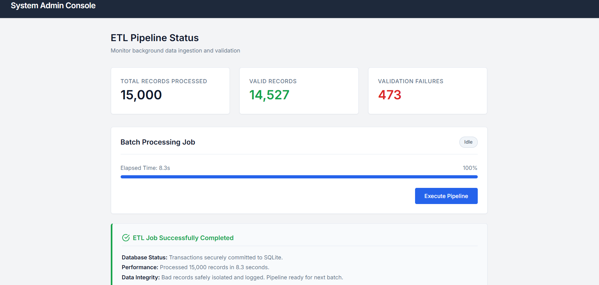

# Enterprise Data Processing Pipeline 🚀


A high-performance, asynchronous backend data processing system designed to ingest, validate, and store large datasets (15,000+ records) efficiently. It features a modern, glassmorphism administrative dashboard for real-time pipeline monitoring.

## 📸 Admin Dashboard Preview
*(Upload the screenshot of your UI here and name it `dashboard preview.png` in the repo to display it to recruiters!)*


## 🏗️ Architecture & Engineering Highlights

This project was built to demonstrate enterprise-grade backend engineering patterns:

- **Asynchronous Task Processing:** Utilizes FastAPI's `BackgroundTasks` to decouple heavy ETL (Extract, Transform, Load) workloads from the HTTP request cycle, ensuring a non-blocking and highly responsive API.
- **Transactional Integrity:** Implements strict database transaction blocks (`BEGIN`, `COMMIT`, `ROLLBACK`). Data is processed in chunks; if a batch fails, it rolls back cleanly to prevent database corruption.
- **Resilient Data Validation:** Leverages Pydantic schemas to strictly validate incoming records. Malformed or malicious data (e.g., negative amounts, invalid emails) is automatically caught, logged, and skipped without crashing the pipeline.
- **Real-Time State Tracking:** The backend maintains a live processing state, exposing a `/stats` polling endpoint. The vanilla JS frontend consumes this to power a dynamic, real-time progress bar.
- **Production Ready:** Fully containerized using Docker, demonstrating DevOps best practices and environment reproducibility.

## 📊 What Happens During Execution?

Since this is an asynchronous pipeline, clicking **"Execute Pipeline"** on the dashboard triggers the following observable events:
1. **Background Job Started:** The FastAPI backend immediately delegates the 15,000-record workload to a background task.
2. **Live Telemetry:** The UI begins polling the `/stats` endpoint. You will see the **Progress Bar** fill dynamically as the server processes data in batches.
3. **Real-time Validation Tracking:** 
   - The **Valid Records** counter tracks data that passes the strict Pydantic schemas.
   - The **Validation Failures** counter will catch and tally the ~3% of bad data intentionally injected by the setup script (e.g., malformed emails, negative transactions).
4. **Clean Completion:** The status badge updates to "Completed" once the database transaction is safely committed, leaving you with a finalized report of the ETL run.

## 🚀 Getting Started (Local Development)

### Windows Quickstart
1. Clone the repository.
2. Run the automated PowerShell setup script:
   ```powershell
   .\run.ps1
   ```
   *This script creates a virtual environment, installs dependencies, generates 15,000 mock records (with intentional edge cases), and starts the Uvicorn server.*
3. Open your browser and navigate to `http://127.0.0.1:8000` to interact with the dashboard.

### Docker Deployment
Deploy instantly to any cloud provider:
```bash
docker build -t enterprise-data-processor .
docker run -p 8000:8000 enterprise-data-processor
```

## 📂 Project Structure
- `app/main.py`: FastAPI application routing and background task delegation.
- `app/processor.py`: Core ETL logic, batch processing, and transactional database insertions.
- `app/models.py`: Pydantic data validation schemas.
- `index.html`: The custom vanilla JS/CSS glassmorphism frontend dashboard.
- `generate_data.py`: Utility script to generate large-scale mock CSV data with intentional errors for validation testing.
